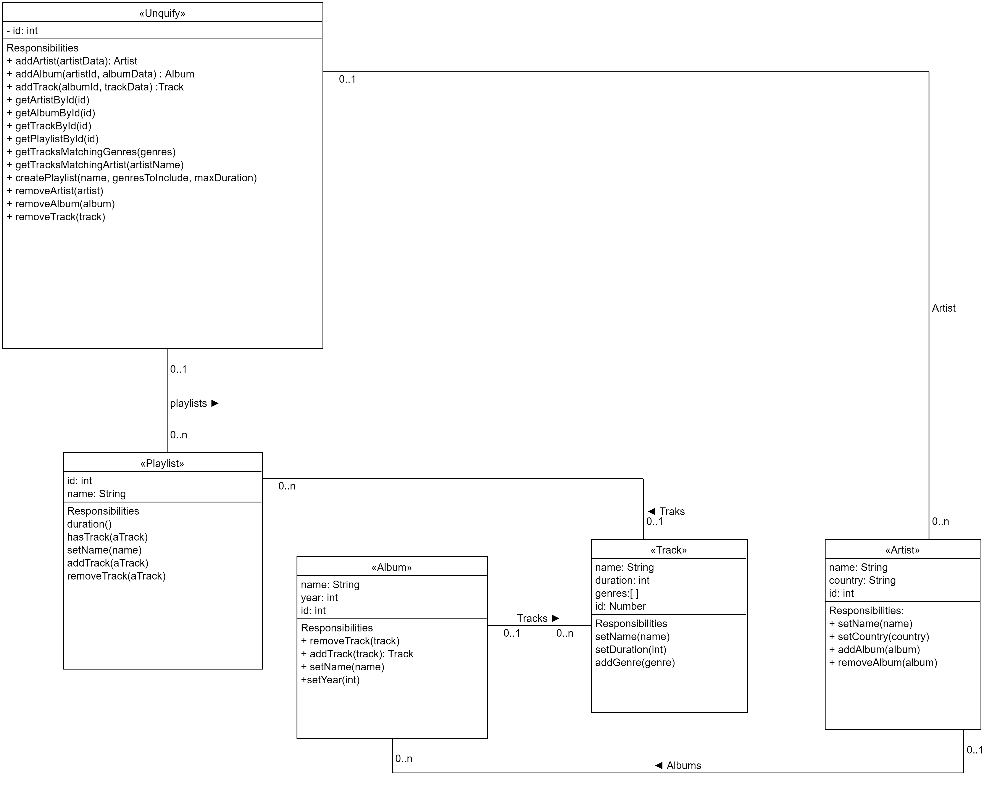

# Servicios Cloud 2021

## Grupo-4

* **Camila Arciniega** - (https://github.com/am-camila)
* **Nicolas Tancredi** - (https://github.com/nikcolastancredi)
* **Nahuel Pereyra** - (https://github.com/nahuelmpereyra)

***

## Diseño UML 📝



***

## Uso 💻

_Una vez clonado el repositorio, nos ubicamos en la raiz de ese directiorio y ejecutamos:_

```
 npm install
```


_Para correr los tests ejecutamos:_
```
 npm test
```

***

## Comandos implementados 📋

_La implementación de UNQfy admite diferentes comandos por consola para poder realizar alta y baja de Artistas, Álbumes, Tracks y Playlists. A continuacion se detallan los comandos que fueron implementados:_

**Los comandos soportados por UNQfy son los siguientes:**
```
addArtist 'name' 'country'
addAlbum 'artistId' 'name' 'year'
addTrack 'albumId' 'name' 'duration' 'genre1' 'genre2' ... 'genreN'
createPlaylist 'name' 'genre1' ... 'genreN' 'maxDuration'
deleteArtist 'artistId'
deleteAlbum 'albumId'
deleteTrack 'trackId'
searchByName 'name'
getTracksMatchingArtist 'artistName'
getTracksMatchingGenres 'genre1' 'genre2' ... 'genreN'
getArtistById 'artistId'
getAlbumById 'albumId'
getTrackById 'trackId'
getPlaylistById 'playlistId'

```

